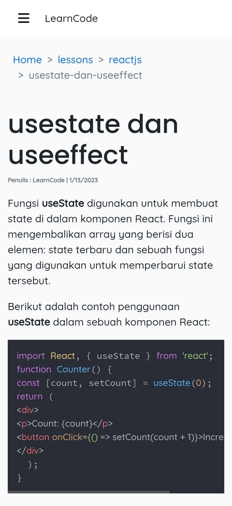

<h1 align="center">LearnCode</h1>
<p align="center">


</p>
<p align="center">Aplikasi untuk belajar programming</p>

<p align="center">

</p>

## instalasi

- silahkan clone repo ini
- masuk kedalam direktori frontend dan jalankan perintah 
    ```sh
    npm install
    ```
- lakukan hal yang sama untuk folder backend

## penggunaan
- pastikan anda berhasil menjalankan backend terlebih dahulu , anda bisa membaca petunjuk nya [disini](https://github.com/udinesia325/LearnCode/blob/dev/backend/README.md)
- setelah backend berjalan, anda bisa berpindah ke frontend dan jalankan perintah
    ```sh
    npm run dev
    ```
- voilaa! anda bisa membuka halaman web dengan menggunakan link dan port yang tertera di terminal


##### this page is not fully responsive as it was developed using Android
